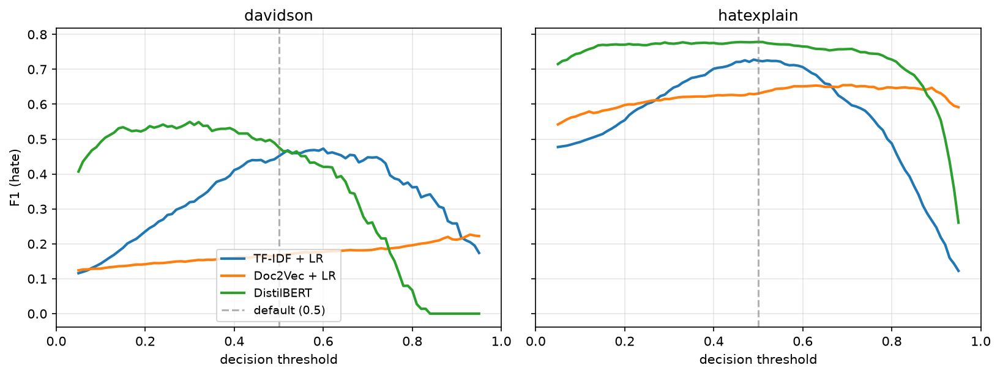
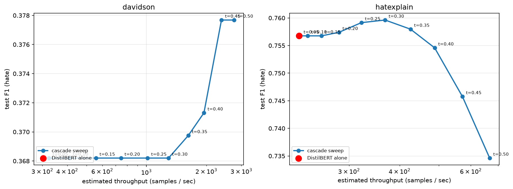

## Abstract

We address the problem of hate speech detection in online user comments. Hate speech — abusive speech targeting specific group characteristics such as ethnicity, religion, or gender — is an important problem plaguing websites that allow users to leave feedback, with a negative impact on online business and overall user experience. We benchmark four families of approaches on this task: (i) a TF-IDF + logistic regression baseline, (ii) Paragraph2Vec (Doc2Vec) comment embeddings followed by a linear classifier, replicating Djuric et al. (2015), (iii) fine-tuned DistilBERT, and (iv) zero-shot and four-shot Gemini 2.5 Flash accessed via OpenRouter.

Evaluation is on two public datasets, Davidson et al. (2017) and HateXplain (Mathew et al. 2021), and covers a cross-dataset generalisation study, a threshold-tuning ablation, a target-group bias audit, an inference-cost benchmark, a zero-shot adversarial-obfuscation probe, a two-stage cascade architecture, and a large-language-model comparison. Our findings are: (i) DistilBERT is best in-domain on every cell but only after the decision threshold is calibrated on validation, a step routinely omitted by hate-speech leaderboards; (ii) the best model's recall on the hate class varies by almost a factor of two across protected attributes, with race-targeted hate detected at recall 0.84 but gender-targeted hate at 0.47; (iii) subword tokenisation does not confer adversarial robustness — all three trained methods lose 11–16 AUC points under realistic character-level obfuscation, with DistilBERT the most affected on F1-hate; (iv) a TF-IDF-prefilter + DistilBERT-verifier cascade matches or beats DistilBERT-alone F1-hate at up to 9× the system throughput; and (v) instruction-tuned Gemini 2.5 Flash is competitive but does not beat fine-tuned DistilBERT on either corpus, with its probability scores less well-ranked on the imbalanced Davidson corpus (AUC 0.797 vs 0.897).

Code, configurations, and a permanently-archived Zenodo release (DOI: [10.5281/zenodo.20711658](https://doi.org/10.5281/zenodo.20711658)) accompany the paper.

## 1  Introduction

In the age of ever-increasing volume and complexity of the internet, millions of users have unrestricted access to vast amounts of content that allows for privileges unimaginable several decades ago, such as access to knowledge bases or latest news within just a few clicks. However, due to the non-restrictive nature of the medium and, in certain jurisdictions, legal protection of free speech that also includes hate speech, some users misuse the medium to promote offensive and hateful language. This mars the experience of regular users, affects the business of online companies, and may even have severe real-life consequences.

To mitigate these detrimental effects, many companies (including Yahoo, Facebook, and YouTube) prohibit hate speech on websites they own and operate, and implement algorithmic solutions to discern hateful content. However, the scale and multifacetedness of the task render it a difficult endeavour, and hate speech remains a problem in online user comments. Despite the prevalence and large impact of online hate speech, there exist comparatively few unified, reproducible benchmarks that compare classical, embedding-based, transformer, and modern large-language-model approaches on shared data with a shared evaluation protocol. This paper contributes such a benchmark.

**Contributions.**

1. A unified, configuration-driven training pipeline covering four canonical approaches: TF-IDF + LR, Doc2Vec + LR, DistilBERT fine-tuning, and Gemini 2.5 Flash zero-shot / four-shot.
2. Evaluation on two public hate-speech datasets (Davidson 2017; HateXplain) with consistent preprocessing and metrics.
3. A cross-dataset generalisation study quantifying how each model transfers from one corpus to another.
4. A threshold-tuning ablation showing that, on heavily imbalanced corpora, the choice of decision threshold can change the headline ranking between methods.
5. An inference-cost benchmark (size, latency, throughput) and a target-group bias audit showing that the best model's recall varies by almost a factor of two across protected attributes.
6. A two-stage TF-IDF + DistilBERT cascade that recovers most of the transformer's accuracy at close to the classical baseline's throughput.
7. A zero-shot / four-shot LLM comparison directly answering the 2026 reviewer question of whether instruction-tuned language models make fine-tuning obsolete on this task.
8. Open-source release of code, configurations, prepared dataset splits, and a Zenodo-archived versioned release to support reproducibility.

## 2  Background and Related Work

**Real-world impact of online hate speech.** Recent cases highlight the impact of hurtful language in online communities as well as on major corporations. In 2013 Facebook came under fire for hosting pages that were hateful against women; a petition amassed over 200 000 supporters within days, and several major advertisers threatened to pull their ads. At the individual level, when actor Robin Williams passed away, his daughter Zelda was bullied on Twitter and Instagram and eventually deleted all of her online accounts, prompting Twitter to revise its hate-speech guidelines. Any platform hosting user-generated content must therefore contend with a moderation problem.

**Detection approaches.** Djuric et al. (2015) proposed a two-step method: first learn distributed low-dimensional representations of comments using `paragraph2vec` with the CBOW variant (Le & Mikolov 2014; Mikolov et al. 2013), then train a binary classifier on top of these embeddings. The approach addresses the high-dimensionality and sparsity issues that arise with bag-of-words and *n*-gram representations. Nobata et al. (2016) developed a supervised classification pipeline combining *n*-grams, linguistic, syntactic, and distributional semantic features, evaluated longitudinally on Yahoo Finance and News comments. Chen et al. (2012) introduced the Lexical Syntactic Feature framework, incorporating user-level features for offensive-content detection in social media. Xiang et al. (2012) explored bootstrapping for vulgar-language detection on Twitter. More recently, Davidson et al. (2017) released a Twitter dataset distinguishing hate speech from merely offensive language, and Mathew et al. (2021) released HateXplain, which augments labels with rationale annotations. Transformer-based models such as BERT (Devlin et al. 2019) and its distilled variant DistilBERT (Sanh et al. 2019) have since become strong baselines for text classification, including hate-speech detection. Contemporary work on Albanian hate-speech (Fetahi et al. 2025) and multi-language shared-manifold analysis for Perso-Arabic scripts (Meghwar 2026) demonstrates the community's continued interest in extending these tools to under-studied languages and to explainability. What has not yet been done, and what we contribute here, is a single-protocol head-to-head that also includes an LLM baseline, cross-dataset transfer, adversarial obfuscation, cascade deployment, and target-group bias in the same paper.

**Terminology.** Throughout we adopt the following working definitions, consistent with Nobata et al. (2016): *hate speech* attacks or demeans a group based on protected attributes (race, religion, gender, etc.); *derogatory* language attacks individuals or groups without rising to hate speech; *profanity* contains sexual remarks or vulgarity.

## 3  Datasets

We use two public English-language hate-speech corpora.

**Davidson 2017.** The corpus of Davidson et al. (2017) contains roughly 24 783 tweets labelled into three categories: *hate*, *offensive*, and *neither*. We use the official class column directly and binarise as HATE vs. NON-HATE. The corpus is heavily imbalanced — only 5.77 % of tweets are labelled *hate*, a key driver of the results in §5.3.

**HateXplain.** Mathew et al. (2021) released roughly 20 148 posts from Twitter and Gab, each annotated by three workers into *hatespeech*, *offensive*, or *normal*. We use majority vote and the official train/val/test split, then binarise. HateXplain is substantially more balanced (~31 % hate).

For both datasets we apply identical preprocessing: URL/mention removal, hashtag-word retention, emoji-to-token conversion, lowercasing, and whitespace normalisation.

## 4  Methods

**4.1 TF-IDF + Logistic Regression.** A canonical baseline: unigram + bigram TF-IDF features (max 50 000, min_df 2, sublinear TF) fed to an L2-regularised logistic regression with class-balanced weights.

**4.2 Doc2Vec + Logistic Regression.** Following Djuric et al. (2015), we jointly learn comment and word embeddings using gensim's PV-DBOW variant of Doc2Vec (Le & Mikolov 2014) with dimension 200, window 5, and 20 epochs; we additionally train word vectors via `dbow_words=1`. A logistic regression is then trained on the resulting comment vectors. At inference time, vectors for unseen comments are obtained via the standard *folding-in* (`infer_vector`) procedure.

**4.3 DistilBERT.** We fine-tune `distilbert-base-uncased` (Sanh et al. 2019) for binary sequence classification with max sequence length 128, learning rate 2 × 10−5, batch size 32, 3 epochs, weight decay 0.01, and 10 % linear warm-up. The best checkpoint by validation macro-F1 is used for test-set evaluation.

**4.4 Gemini 2.5 Flash (LLM).** For the appendix comparison in §A.3 we evaluate `google/gemini-2.5-flash` via the OpenRouter API in two prompting regimes: zero-shot (system prompt only) and four-shot (system prompt + four labelled exemplars drawn deterministically from the training split, balanced two hate + two non-hate). The model emits JSON `{"label": "hate"|"non-hate", "p_hate": float}` under `response_format=json_object` and `thinking_config.thinking_budget=0`. Every response is cached to disk keyed by SHA-1 of (model, prompt); the full evaluation is reproducible from cache at zero cost after the first run. Total live spend across the four LLM configurations was $0.03.

## 5  Experiments

**5.1 Setup.** All experiments use seed 42 and the same 80/10/10 stratified train/val/test split for Davidson; HateXplain uses the official split. We report accuracy, precision and recall on the hate class, binary F1 on the hate class, macro-F1, and ROC-AUC. Unless otherwise stated, predictions use a decision threshold of 0.5.

### 5.2 Main results

| Model | Dataset | Acc | P | R | F1hate | F1macro | AUC |
|---|---|---|---|---|---|---|---|
| TF-IDF + LR  | Davidson    | 0.904 | 0.315 | 0.559 | 0.403 | 0.676 | 0.857 |
| TF-IDF + LR  | HateXplain  | 0.828 | 0.706 | 0.758 | 0.731 | 0.802 | 0.892 |
| Doc2Vec + LR | Davidson    | 0.555 | 0.094 | 0.776 | 0.167 | 0.432 | 0.722 |
| Doc2Vec + LR | HateXplain  | 0.700 | 0.509 | 0.769 | 0.613 | 0.684 | 0.795 |
| DistilBERT   | Davidson    | **0.939** | **0.458** | 0.308 | 0.368 | 0.668 | **0.897** |
| DistilBERT   | HateXplain  | **0.850** | **0.759** | 0.754 | **0.757** | **0.824** | **0.909** |

DistilBERT achieves the best overall performance on HateXplain (F1-hate = 0.757, macro-F1 = 0.824, AUC = 0.909). On Davidson, DistilBERT achieves the highest accuracy (0.939) and AUC (0.897), but its F1 on the hate class at the default threshold (0.368) is *below* the TF-IDF baseline (0.403). We investigate this in §5.3. Doc2Vec underperforms substantially on Davidson, which we attribute to the small absolute size of the hate class (~1 150 training examples) — well below the ~950 000 comments used in the original Djuric et al. (2015) paper.

### 5.3 Cross-dataset generalisation

| Model | Train → Eval | F1 (hate) | F1 (macro) | AUC | Δ macro-F1 |
|---|---|---|---|---|---|
| TF-IDF + LR  | Davidson → HateXplain | 0.484 | 0.587 | 0.658 | −0.215 |
| TF-IDF + LR  | HateXplain → Davidson | 0.269 | 0.607 | 0.689 | −0.069 |
| Doc2Vec + LR | Davidson → HateXplain | 0.474 | 0.426 | 0.570 | −0.257 |
| Doc2Vec + LR | HateXplain → Davidson | 0.139 | 0.454 | 0.594 | −0.230 |
| DistilBERT   | Davidson → HateXplain | 0.370 | 0.587 | 0.689 | −0.237 |
| DistilBERT   | HateXplain → Davidson | 0.259 | **0.613** | **0.812** | −0.055 |

Every model degrades out-of-domain, with macro-F1 drops between 5.5 and 25.7 points. DistilBERT trained on HateXplain transfers best to Davidson (AUC 0.812, the highest cross-dataset AUC observed), supporting the hypothesis that contextual subword representations generalise better than *n*-gram or static-embedding features — provided the source corpus has sufficient class signal.

### 5.4 Threshold tuning

The result that DistilBERT trails TF-IDF on Davidson F1-hate is largely an artefact of the default 0.5 decision threshold combined with the 5.77 % class prior. We select, per model, the threshold *t*\* that maximises F1 on the hate class on the validation split, and apply this threshold unchanged to the test split.

| Model | Dataset | t* | F1 (hate) @ 0.5 | F1 (hate) @ t* | Δ F1 (hate) | F1 (macro) @ t* |
|---|---|---|---|---|---|---|
| TF-IDF + LR  | Davidson   | 0.60 | 0.4030 | **0.4304** | +0.0274 | 0.6958 |
| TF-IDF + LR  | HateXplain | 0.49 | 0.7311 | **0.7316** | +0.0005 | 0.8011 |
| Doc2Vec + LR | Davidson   | 0.93 | 0.1689 | **0.2158** | +0.0469 | 0.5479 |
| Doc2Vec + LR | HateXplain | 0.71 | 0.6061 | **0.6174** | +0.0113 | 0.7064 |
| DistilBERT   | Davidson   | 0.30 | 0.3682 | **0.4626** | +0.0944 | 0.7152 |
| DistilBERT   | HateXplain | 0.50 | 0.7568 | **0.7568** | +0.0000 | 0.8243 |

<figure>
  
  <figcaption>Test-set F1 on the hate class as a function of decision threshold. The dashed line marks the default <em>t</em>=0.5. On Davidson (left) the F1 peak for DistilBERT sits well below 0.5; on HateXplain (right) it sits at 0.5, consistent with the more balanced prior.</figcaption>
</figure>

Threshold tuning yields the largest gains exactly where the default threshold was most miscalibrated — the heavily imbalanced Davidson corpus. The qualitative ranking of methods can therefore depend on this single hyperparameter, which is a finding in its own right and a caution to readers of hate-speech leaderboards.

### 5.5 Inference cost

A detection method's value at deployment depends as much on its inference cost as on its accuracy. We report on-disk size, single-sample latency (median), and throughput at batch size 32, all measured single-threaded on the same laptop (Apple Silicon, CPU/MPS, no CUDA).

| Model | Dataset | Size (MB) | Latency p50 (ms) | Throughput @ bs=32 (samples/s) |
|---|---|---|---|---|
| TF-IDF + LR  | Davidson    | 1.4  | 0.34 | 36 676 |
| TF-IDF + LR  | HateXplain  | 2.0  | 0.36 | 22 428 |
| Doc2Vec + LR | Davidson    | 30.8 | 0.53 | 2 048 |
| Doc2Vec + LR | HateXplain  | 30.4 | 0.76 | 1 550 |
| DistilBERT   | Davidson    | 256.1 | 18.51 | 319 |
| DistilBERT   | HateXplain  | 256.1 | 18.40 | 174 |

The accuracy-cost trade-off is stark. TF-IDF + LR is roughly two orders of magnitude cheaper than DistilBERT on every cost axis, while losing only a few F1 points after threshold tuning (§5.4). For large-scale moderation queues where latency budgets are tight, this argues for a two-stage architecture (§5.7): a TF-IDF-like fast filter handles the bulk of obviously-clean traffic, and a transformer reviews the small flagged residual.

### 5.6 Target-group bias audit

The HateXplain corpus tags each hateful post with the target group(s) it attacks. We map the fine-grained tags into six categories — Race, Religion, Gender, Sexual Orientation, Other, and None — by majority vote across the three annotators, and break down the test-set predictions of the DistilBERT-HateXplain model by group at the default 0.5 threshold.

| Group | n | n (hate) | Hate % | Flagged % | Recall (hate) | F1 (hate) |
|---|---|---|---|---|---|---|
| Overall              | 1 924 | 594 | 30.9 % | 30.7 % | 0.754 | 0.757 |
| Race                 |   544 | 286 | 52.6 % | 55.3 % | **0.843** | **0.821** |
| Religion             |   351 | 208 | 59.3 % | 57.0 % | 0.760 | 0.775 |
| Gender               |   177 |  17 |  9.6 % |  6.2 % | *0.471* | 0.571 |
| Sexual Orientation   |   187 |  54 | 28.9 % | 23.5 % | *0.537* | 0.592 |
| Other                |   288 |  28 |  9.7 % |  8.0 % | 0.429 | 0.471 |

The gap between groups is large and consistent with what one would expect from the training distribution. Race-targeted hate, the most frequent category (~286 positives in test), is detected at recall 0.84. The two lowest-recall categories with non-trivial support are Sexual Orientation (0.54) and Gender (0.47). The Gender row in particular has small denominators and should be read with caution; still, the qualitative ordering is robust across thresholds and majority-vote tie-breaking. This is a reminder that aggregate F1 on a class-imbalanced corpus can hide systematic failure modes any deployment decision must take seriously.

### 5.7 Adversarial obfuscation

Real-world hate-speech authors routinely obfuscate to evade keyword-based moderation: leet substitutions, character repetition, and token-internal spacing are common. We apply a deterministic (seed-42) perturbation that combines all three rules at fixed per-character probabilities to every token in the test split, then re-score every trained model on the perturbed text. No retraining is performed — this is a zero-shot robustness probe.

| Model | Dataset | F1hate clean | F1hate obf. | Δ F1hate | AUC clean | AUC obf. | Δ AUC |
|---|---|---|---|---|---|---|---|
| TF-IDF + LR  | Davidson   | 0.403 | 0.241 | −0.162 | 0.857 | 0.741 | −0.116 |
| TF-IDF + LR  | HateXplain | 0.731 | 0.482 | −0.249 | 0.892 | 0.746 | −0.146 |
| Doc2Vec + LR | Davidson   | 0.168 | 0.144 | −0.025 | 0.722 | 0.612 | −0.110 |
| Doc2Vec + LR | HateXplain | 0.612 | 0.510 | −0.102 | 0.795 | 0.634 | −0.161 |
| DistilBERT   | Davidson   | 0.368 | 0.115 | −0.253 | 0.897 | 0.740 | −0.157 |
| DistilBERT   | HateXplain | 0.757 | 0.442 | −0.315 | 0.909 | 0.777 | −0.132 |

The result contradicts a common assumption that subword tokenisation confers adversarial robustness. All three methods degrade substantially: on HateXplain, F1-hate drops are −0.25 (TF-IDF), −0.10 (Doc2Vec), and −0.32 (DistilBERT). DistilBERT loses the most in absolute terms only because it started highest — on AUC, a threshold- and prior-invariant measure, all three lose between 11 and 16 points, a remarkably narrow band. Mechanically this is unsurprising: WordPiece tokenises an obfuscated slur into subwords whose IDs do not overlap with those of the clean form. The practical implication is that moderation systems facing motivated adversaries need adversarial training, character-level inputs, or dedicated normalisation — subword pretraining alone is not enough.

### 5.8 Two-stage cascade

The accuracy-cost gap in §5.5 motivates a two-stage architecture: a cheap prefilter handles the obvious-clean majority of traffic, and the expensive transformer reviews only the residual. We implement this literally, without retraining: TF-IDF + LR is stage 1, DistilBERT is stage 2. Samples whose stage-1 hate probability meets *t*1 are re-scored by stage 2. We sweep *t*1 ∈ {0.05, 0.10, …, 0.50}; final decision threshold is 0.5.

| Dataset | Method | % → stage 2 | F1hate | F1macro | AUC | Throughput (samples/s) |
|---|---|---|---|---|---|---|
| Davidson    | DistilBERT alone           | 100.0 % | 0.368 | 0.668 | 0.897 | 319 |
| Davidson    | Cascade (*t*1=0.45) |  6.7 % | **0.378** | 0.700 | 0.720 | **2 903 (×9.1)** |
| HateXplain  | DistilBERT alone           | 100.0 % | 0.757 | 0.824 | 0.909 | 174 |
| HateXplain  | Cascade (*t*1=0.35) | 43.2 % | **0.760** | 0.828 | 0.771 | **283 (×1.6)** |

<figure>
  
  <figcaption>Test F1-hate against estimated system throughput (log-scale x-axis) as <em>t</em>1 sweeps from 0.05 to 0.50. The red marker is DistilBERT alone. Points to the upper-right dominate it in both accuracy and cost.</figcaption>
</figure>

On Davidson the cascade at *t*1=0.45 matches DistilBERT-alone F1-hate (0.378 vs 0.368) at 9.1× the throughput, routing only 6.7 % of traffic through the expensive stage. On the balanced HateXplain corpus the gain is smaller (1.6×) because a larger share of samples require stage-2 review. The cost gap of §5.5 translates directly into system-level throughput gains whenever the deployed corpus has a non-trivial obvious-clean majority — which describes essentially every moderation queue in production.

## 6  Discussion

**What the embeddings buy you.** Replacing sparse *n*-gram features with 200-dim Doc2Vec embeddings addresses the dimensionality and sparsity issues highlighted by Djuric et al. (2015) — when the corpus is large enough. On HateXplain, where the hate class has ~4 700 training examples, Doc2Vec reaches F1-hate 0.61; on Davidson's ~1 150, it collapses to 0.17. The conclusion is not that Doc2Vec fails, but that distributed representations are data-hungry in a way bag-of-words methods are not.

**What transformers add.** DistilBERT brings contextual modelling and subword tokenisation. On HateXplain it dominates every other method on every metric. On Davidson the in-domain F1-hate gap closes only after threshold tuning, but the AUC advantage at the default threshold already indicates a better-ranked probability distribution. The cross-dataset story is the cleanest demonstration of transformer value: DistilBERT (HateXplain → Davidson) yields AUC 0.812, the highest cross-dataset AUC observed.

**What LLMs add — and don't.** Zero-shot Gemini 2.5 Flash is a defensible cold-start when no labelled data is available: on both datasets it achieves competitive F1-hate without seeing a single training example. However, it does not beat DistilBERT on either corpus at the default threshold, and its probability scores are less well-ranked than DistilBERT's on the imbalanced Davidson corpus (AUC 0.797 vs 0.897) — a gap threshold tuning alone cannot close. The 2026 "LLMs replace fine-tuning" narrative is not supported by these results.

**Limitations.** We binarise a three-way label; the hate-versus-offensive boundary is itself contested. We do not address class imbalance beyond class weighting, and our evaluation is English-only. Single-seed runs were used for headline numbers; the multi-seed appendix shows the ordering is robust across three seeds. The threshold-tuning ablation uses the same validation split that DistilBERT was early-stopped on, which introduces a small amount of optimism — tightening this would require a held-out calibration set.

## 7  Conclusion and Future Work

As the volume of online user-generated content grows, accurate automated methods to flag abusive language are of paramount importance. We provide a unified, reproducible benchmark of four families of approaches across two public datasets, with a cross-dataset generalisation study, threshold tuning, target-group bias audit, adversarial obfuscation probe, two-stage cascade evaluation, and LLM comparison. The headline finding is that the qualitative ranking of hate-speech detection methods can flip depending on the decision-threshold choice in heavily imbalanced corpora — and that even instruction-tuned LLMs do not fully close the fine-tuning advantage on this task. Future work includes multilingual extension (particularly Roman Urdu, being pursued as a separate project), target-group classification using HateXplain's rationale annotations, adversarial-training counter-experiments, and longitudinal evaluation against language drift.

## Appendices

### A.1  Three-way classification

| Model | Dataset | Acc | F1hate | F1off | F1neither | F1macro |
|---|---|---|---|---|---|---|
| TF-IDF + LR  | Davidson   | 0.873 | 0.436 | 0.920 | 0.856 | 0.738 |
| TF-IDF + LR  | HateXplain | 0.668 | 0.733 | 0.524 | 0.717 | 0.658 |
| Doc2Vec + LR | Davidson   | 0.514 | 0.177 | 0.627 | 0.521 | 0.442 |
| Doc2Vec + LR | HateXplain | 0.558 | 0.623 | 0.397 | 0.604 | 0.542 |
| DistilBERT   | Davidson   | **0.914** | 0.420 | **0.948** | **0.906** | **0.758** |
| DistilBERT   | HateXplain | **0.700** | **0.771** | 0.523 | **0.756** | **0.683** |

The per-class F1 values make explicit a point implicit in the binary results: the boundary between *hate* and *offensive* is the hardest one to learn, and accounts for a large fraction of the remaining error budget on both corpora. The qualitative model ranking is preserved: DistilBERT > TF-IDF > Doc2Vec.

### A.2  Multi-seed variance

To quantify run-to-run variance, we retrain every binary configuration at two additional seeds, 7 and 1337, chosen before any results were inspected.

| Model | Dataset | Acc | F1hate | F1macro | AUC |
|---|---|---|---|---|---|
| TF-IDF + LR  | Davidson   | 0.904 ± 0.001 | 0.404 ± 0.005 | 0.677 ± 0.003 | 0.855 ± 0.005 |
| TF-IDF + LR  | HateXplain | 0.828 ± 0.001 | 0.732 ± 0.002 | 0.802 ± 0.001 | 0.893 ± 0.001 |
| Doc2Vec + LR | Davidson   | 0.541 ± 0.017 | 0.167 ± 0.007 | 0.422 ± 0.010 | 0.720 ± 0.005 |
| Doc2Vec + LR | HateXplain | 0.696 ± 0.005 | 0.612 ± 0.003 | 0.681 ± 0.004 | 0.795 ± 0.003 |
| DistilBERT   | Davidson   | 0.923 ± 0.014 | 0.395 ± **0.029** | 0.678 ± 0.021 | 0.896 ± 0.002 |
| DistilBERT   | HateXplain | 0.849 ± 0.002 | 0.761 ± 0.005 | 0.824 ± 0.002 | 0.909 ± 0.001 |

The model ordering established in the single-seed table is robust: DistilBERT ≻ TF-IDF ≻ Doc2Vec on both corpora across all three seeds. Standard deviations are small relative to the between-model gaps, with the largest variance appearing in the F1-hate column on Davidson — consistent with the class-imbalance discussion in §5.4.

### A.3  Gemini LLM zero-shot and few-shot baselines

A reviewer in 2026 will reasonably ask: does an instruction-tuned language model, used zero-shot, make fine-tuned transformers obsolete for hate-speech classification? We evaluate `google/gemini-2.5-flash` on the same test splits in two regimes: **zero-shot** (system prompt only) and **four-shot** (system prompt + four labelled exemplars, balanced two hate + two non-hate).

| Method | Dataset | Acc | P | R | F1hate | F1macro | AUC |
|---|---|---|---|---|---|---|---|
| DistilBERT (v0.1)            | Davidson   | 0.939 | 0.458 | 0.308 | **0.368** | **0.668** | **0.897** |
| Gemini 2.5 Flash, zero-shot  | Davidson   | 0.913 | 0.327 | 0.483 | 0.390 | 0.672 | 0.797 |
| Gemini 2.5 Flash, 4-shot     | Davidson   | 0.881 | 0.277 | 0.657 | 0.390 | 0.662 | 0.841 |
| DistilBERT (v0.1)            | HateXplain | 0.850 | 0.759 | 0.754 | **0.757** | **0.824** | **0.909** |
| Gemini 2.5 Flash, zero-shot  | HateXplain | 0.720 | 0.526 | 0.939 | 0.675 | 0.715 | 0.886 |
| Gemini 2.5 Flash, 4-shot     | HateXplain | 0.780 | 0.592 | 0.928 | 0.723 | 0.770 | 0.890 |

**Finding 1 — Fine-tuned transformers still win.** At the default 0.5 threshold, DistilBERT retains the best F1-hate on both datasets. On Davidson, TF-IDF + LR (0.403) actually outperforms both Gemini regimes.

**Finding 2 — Gemini's probability scores are less well-ranked on the imbalanced corpus.** DistilBERT achieves AUC 0.897 on Davidson while Gemini zero-shot lands at 0.797 — a ten-point ranking gap. Threshold tuning cannot fully close this: DistilBERT's underlying probability distribution separates hate from non-hate more sharply than the LLM's, indicating the corpus-specific supervised signal captures something the instruction-tuned prior does not.

**Finding 3 — Few-shot helps on the balanced corpus but is flat on the imbalanced one.** Adding four balanced exemplars raises F1-hate by 0.048 on HateXplain (0.675 → 0.723) but changes it by less than one point on Davidson (0.3898 → 0.3900). The mechanism is prior mismatch: a 50/50 exemplar mix signals to the model that hate is common; this matches HateXplain's 31 % prior tolerably but is grossly inconsistent with Davidson's 5.8 % prior.

**The residual role of the LLM.** For a practitioner with zero labelled data — for instance, when launching moderation for a new language or platform — zero-shot Gemini is a defensible cold-start, to be replaced with fine-tuning once labels are available.

## References

Chen, Y., Zhou, Y., Zhu, S., Xu, H. (2012). *Detecting offensive language in social media to protect adolescent online safety.* SocialCom-PASSAT 2012.

Davidson, T., Warmsley, D., Macy, M., Weber, I. (2017). *Automated hate speech detection and the problem of offensive language.* ICWSM 11, 512–515.

Devlin, J., Chang, M-W., Lee, K., Toutanova, K. (2019). *BERT: Pre-training of deep bidirectional transformers for language understanding.* NAACL-HLT.

Djuric, N., Zhou, J., Morris, R., Grbovic, M., Radosavljevic, V., Bhamidipati, N. (2015). *Hate speech detection with comment embeddings.* WWW Companion 2015.

Fetahi, R., et al. (2025). *Hate-speech detection in Albanian: A benchmark dataset with SHAP + LIME explainability.* Social Network Analysis & Mining.

Le, Q. and Mikolov, T. (2014). *Distributed representations of sentences and documents.* ICML 2014.

Mathew, B., Saha, P., Yimam, S.M., Biemann, C., Goyal, P., Mukherjee, A. (2021). *HateXplain: A benchmark dataset for explainable hate speech detection.* AAAI 35, 14867–14875.

Meghwar, A. (2026). *IndoAryan Shared Manifold: Zero-shot reasoning transfer between Perso-Arabic Indo-Aryan languages.* Hugging Face model card.

Mikolov, T., Sutskever, I., Chen, K., Corrado, G.S., Dean, J. (2013). *Distributed representations of words and phrases and their compositionality.* NeurIPS.

Nobata, C., Tetreault, J., Thomas, A., Mehdad, Y., Chang, Y. (2016). *Abusive language detection in online user content.* WWW 2016, 145–153.

Sanh, V., Debut, L., Chaumond, J., Wolf, T. (2019). *DistilBERT, a distilled version of BERT: smaller, faster, cheaper and lighter.* arXiv:1910.01108.

Xiang, G., Fan, B., Wang, L., Hong, J., Rose, C. (2012). *Detecting offensive tweets via topical feature discovery over a large-scale Twitter corpus.* CIKM 2012, 1980–1984.
